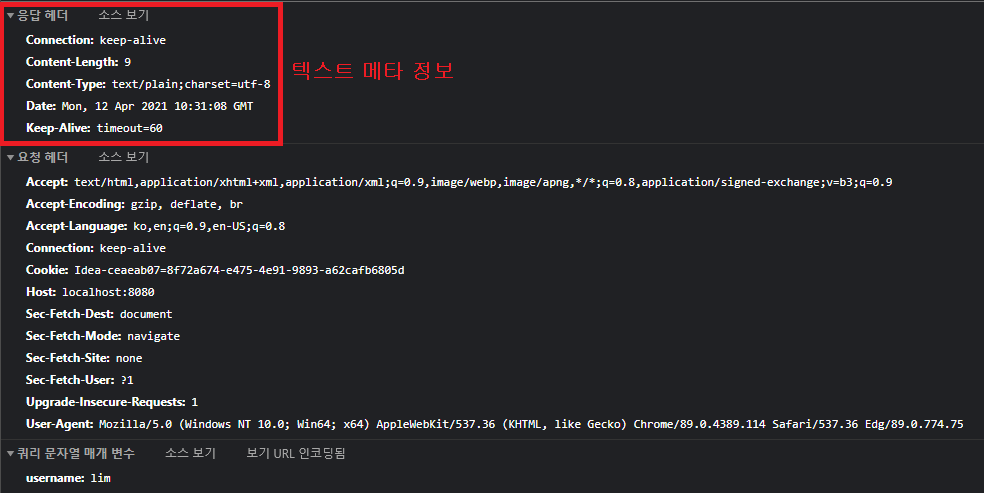
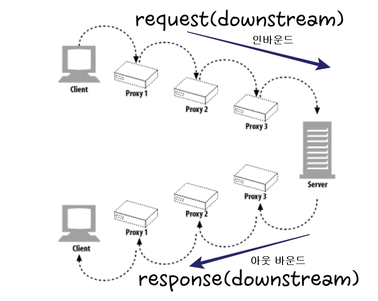
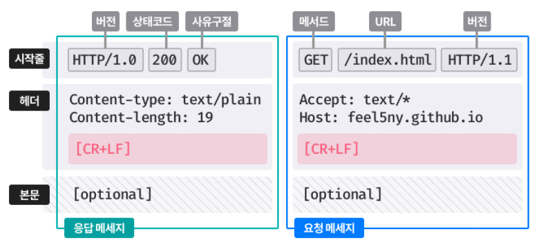

# HTTP 메세지

## 목차
* 용어 정리
  
* [메세지의 흐름](#메시지의_흐름)


## 메시지의 흐름

* 메시지는 HTTP 애플리케이션 간 주고받는 데이터 블록
    * 메시지의 내용과 의미를 설명하는 **텍스트 메타 정보**로 시작
    * 그 다음 **선택적**으로 데이터가 보내짐.
    
      

* 이 메시지들은 `클라이언트`, `서버`, `프록시` 사이를 흐른다.
* 흐름의 방향에 따라 `인바운드`, `아웃바운드`, `업스트림`, `다운스트림`으로 정의됨.

### 기본적인 흐름

#### 메시지는 원 서버 방향을 인바운드로 하여 송신된다.
* 앞서 설명한 `인바운드`, `아웃바운드`는 트랜잭션 방향을 표현하기 위해서 사용된다.
    * `인바운드` : 원 서버로 향하는 방향
    * `아웃바운드` : 모든 처리가 끝난 뒤 메시지가 클라이언트에게 돌아오는 방향


#### 다운스트림으로 흐르는 메시지
* `업스트림`과 `다운스트림`은 **발송자 와 수신자에 관한 용어**이다. 간단하게 HTTP 메시지를 물에 비유를 하자.
  * 강물은 상류에서 하류로 흐른다. 메시지 또한 **발송자 에게서 수신자 에게로 전달이 된다.**
  * 그렇기 때문에 `요청 메시지`이든 `응답 메시지`이든 간에 **모든 메시지는 `다운스트림`으로 흐른다.**  
    
    
    
***

## 메시지 구성요소
* 메시지는 `시작줄`, `헤더 블록`, `본문` 이렇게 세 부분으로 이루어 진다.
    * 시작줄 : `텍스트 메타 정보`를 가짐
    * 헤더 블록 : 속성을 가지고 있음
      * 시작줄과 헤더 블록은 `개행 문자`와 `캐리지 리턴(줄바꿈)`으로 끝난다.
    <br></br>
    * 본문 : 데이터를 담고 있음 (선택사항)
        * 엔티티 본문이나 메시지 본문은 데이터를 포함할 수도 비어있을 수도 있다.
    

***

## 메시지 문법
* 모든 HTTP메시지는 `요청 메시지`와 `응답 메시지`로 나뉜다.
  
### 요청 메시지 : 웹 서버에 어떠한 동작을 `요청`
  ```
  <메서드> <요청 URI> <버전>   ==> 시작줄
  <헤더>                      ==> 헤더
  
  <엔티티 본문>                ==> 본문
  ```

### 응답 메시지 : `요청의 결과`를 클라이언트에 돌려줌.
  ```
  <버전> <상태 코드> <사유 구절>   ==> 시작줄
  <헤더>                          ==> 헤더
  
  <엔티티 본문>                   ==> 본문
  ```

<br></br>
  

    
## 용어 정리

### 메서드
* 요청 동작 `GET`, `HEAD`, `POST`와 같이 한 단어로 되어 있음.  

  |메서드|설명|본문 유무|
  |:-------:|:------------------:|:--:|
  |GET|문서 가져오기|없음|
  |HEAD|문서의 헤더만 가져오기|없음|
  |POST|서버가 처리할데이터 전송|**있음**|
  |PUT|요청 메시지의 본문을 저장|**있음**|
  |TRACE|프록시를 거쳐 서버에 도달하는 과정을 추적(진단 목적)|없음|
  |OPTIONS|어떤 메서드를 수행할 수 있는지 확인|없음|
  |DELETE|문서 제거|없음|
  

* **안전한 메서드**
  * `GET`과 `HEAD`와 같이 서버에 어떤 작용도 없는 메서드들을 안전한 메서드라고 한다.
<br></br>
* `HEAD`
  * 리소스를 가져오지 않고도 그에 대한 정보(ex: 타입)을 알 수 있다.
  * 응답 상태 코드를 통해, 개체의 유무를 알 수 있다.
  * 헤더를 확인해 리소스의 변경을 검사할 수 있다.
  * 반드시 반환 헤더가 **GET으로 얻는 것과 정확히 일치함을 보장**해야 한다.
  

### 헤더
* **종류**
  * 일반 헤더 : 요청과 응답 양쪽에 모두 나타낼 수 있음
  * 요청 헤더 : `요청`에 대한 부가 정보를 제공
  * 응답 헤더 : `응답`에 대한 부가 정보를 제공
  * 엔티티 헤더 : **본문 크기와 콘텐츠, 혹은 리소스 그 자체를 서술**
  <br></br>
* **기초 문법**
  * HTTP 헤더는 이름, 쉼표, 공백, 필드 값, CRLF(캐리지리턴)이 순서대로 나열된다.
    * Date:Tue, 3 Oct 1997 02:16:03 GMT // 서버가 응답을 만들어 낸 시간
    * Content-length: 15040 // 15,040바이트의 데이터를 포함한 엔티티 본문
  


### 상태 코드
* 요청 중 무엇이 일어났는지를 클라이언트에게 설명해주는 코드 (크게 `성공`, `에러`가 있다.)

  |범위|정의된 범위|분류|
  |:-------:|:-------:|:-------:|
  |100-199|100-101|정보|
  |200-299|200-206|성공|
  |300-399|300-305|리다이렉션|
  |400-499|400-415|클라이언트 에러|
  |500-599|500-505|서버 에러|

* 대표적인 예
  * 200 : `OK`로 성공
  * 401 : `Unauthorized`로 사용자 이름(ID)와 비밀번호(password)를 입력해야 한다.
  * 404 : `Not Found`로 요청한 URI에 대한 리소스를 찾지 못한 경우에 발생


### 사유 구절
* `상태 코드`를 사람이 이해할 수 있게 설명해주는 짧은 문구.
* 상태코드에서 쓴 `OK`, `Unauthorized`, `Not Found` 들이 사유 구절에 속한다.
  

